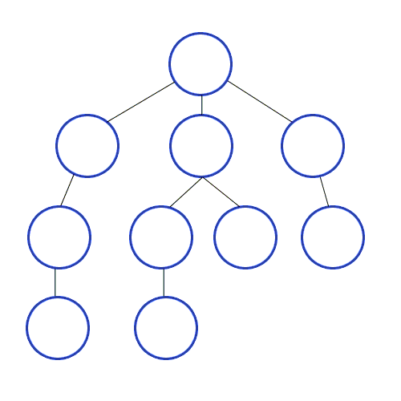

# Updating..

## Algorithm
### 1. BFS
 - 별도의 2차원 Map을 그려 greedy search 함.
 - 탐색할 노드가 들어있는 Queue를 만들어, Queue에 들어오는 Node 순으로 연결되어 있는 노드를 찾음.
 - Pseudocode
    - 1. 시작 노드를 Queue 에 추가
    - 2. 시작 노드의 child 노드를 Queue에 추가
    - 3. 더이상 추가할 노드가 없는 경우 Queue의 다음 노드를 시작 노드로 변경
    - 3. Queue 마지막까지 2번 사항 반복

    

### 2. DFS
 - 재귀 순환 함수를 사용
 - 자식 노드 순으로 서칭하는 경우 재귀 함수를 이용하면 간단하게 해결할 수 있음.
 - Pseudocode
    - 1. Parent Node 부터 왼쪽 자식 Node 까지 내려가면서 서칭
    - 2. 더 이상 자식 왼쪽 자식 Node 가 없는 경우 그 다음 우측 자식 노드 확인.

    
